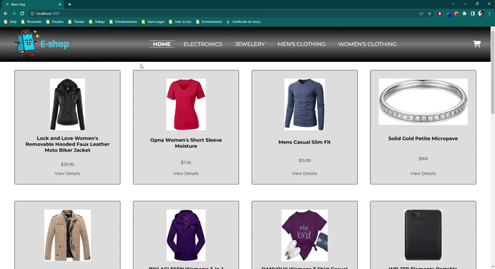

# E-commerce app para curso React.js de Coderhouse

## Objetivo:
Crear una app simple de un e-commerce integrando firebase y estructuras de código en React.js

## Demo de flujo de compra

## Link app viva

[Visita una demo en vivo](https://coderhouse-react-app-leandro-lopez.netlify.app/)

***

## Set up para desarrollo local

### Inicializar

1. `npm i`
2. `npm run start`

### Configuración de Firebase

1. Crear un archivo .env en el root `/` usando como base `.env.sample`
2. Cambiar las configuraciones según las credenciales de Firebase. [Cómo conseguir credenciales](https://firebase.google.com/docs/web/setup?authuser=1&hl=es)
4. Ejecutar comando para cargar productos de muestra en Firebase `npm run upload-products`

***

## Referencias

### Librerías externas usadas

- [Fonts awsome](https://fontawesome.com/)
- [Firebase/Firestore](https://firebase.google.com/)
- [Sweet Alert 2](https://sweetalert2.github.io/)

## Comentarios

El diseño es actualmente solo para versión desktop.
A medida que pueda iré agregando un diseño responsivo y flujo de autenticación.
